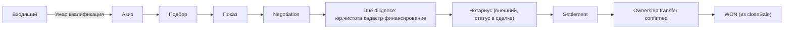
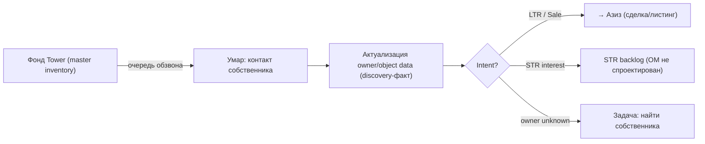
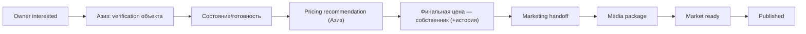
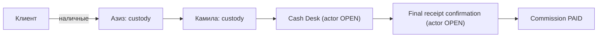
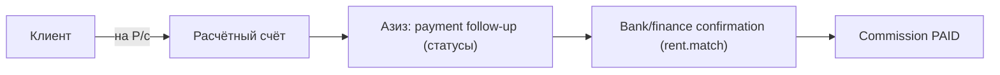
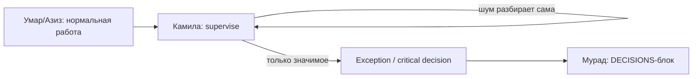

# Tower Operating Chain — как Tower работает как единая система

> **Назначение.** Сводная Operating Model контура Tower: как реально проходит бизнес end-to-end через 4 роли (`Умар → Азиз → Камила → CEO`). Собрано из профилей `docs/23`–`docs/26`, сверено с `docs/SYSTEM_MAP.md` (реальный код).
>
> **Границы документа (жёстко):**
> - `APPROVED OPERATING MODEL` в §6 = подтверждённая **бизнес-логика для документа**, **НЕ** разрешение на migration / schema / code change.
> - Не создаём техническую сущность Intake/Lead только потому, что в цепочке есть отдельный этап Умара — сначала логический lifecycle, техмодель = `ENTITY DECISION NEEDED`.
> - Marketing и Services — только как **handoff-boundary** (что передаём → кому → в каком состоянии → что получаем), их OM здесь не проектируем.
> - Protected documents — описываем требования к данным/доступу/аудиту, но **не** решаем storage/encryption/schema; PII/passport/ID = restricted data class.
> - M3 не перерабатываем; после сборки — стоп.

---

## 1. ACTORS

| Actor | Роль в коде | Суть | Профиль |
|---|---|---|---|
| **Умар** | `CALL_CENTER` | discovery + маршрутизатор; до квалификации, не дальше | `docs/23` |
| **Азиз** | `BROKER` | брокер полного цикла: лид → договор → передача → комиссия; листинг | `docs/24` |
| **Камила** | `COMMERCIAL_DIRECTOR` | control tower: supervise + coach + intervene + фильтр перед CEO | `docs/25` |
| **Мурад** | `CEO` | портфель: MONEY→PERFORMANCE→RISKS→DECISIONS; Tower — один блок | `docs/26` |
| Marketing | `MARKETING` | **handoff-boundary**: медиа/публикация листинга | — |
| Services | (Services-контур) | **handoff-boundary**: приём клиента после move-in | — |
| Finance / Bank | `FINANCE_OPS_LEAD`/`JUNIOR_FINANCE` | подтверждение поступления (bank-match), выплата бонусов | — |
| Нотариус | внешний | шаг в sale-journey (статус в сделке, не роль DMS) | — |

---

## 2. END-TO-END OPERATING CHAIN

### A. Входящий клиент на аренду (LTR/Office)

```mermaid
flowchart LR
  IN["Входящий (тел/TG)"] -->|Умар: контакт SLA| Q["Квалификация намерения"]
  Q -->|handoff + push| AZ["Азиз: owner процесса"]
  AZ --> SEL[Подбор] --> SHOW["Показ (Азиз)"] --> OFF["Offer → к собственнику"]
  OFF --> NEG[Negotiation] --> CT["Договор по шаблону"]
  CT --> PAY["Оплата: CASH custody / BANK follow-up"]
  PAY --> HO["Handover / move-in: акт·фото·счётчики·ключи"]
  HO --> SV["Services handoff"] --> CLOSE["WON (из activateLease)"]
```

### B. Входящий клиент на покупку (Sale/Resale)

### C. Исходящий owner discovery

### D. Listing lifecycle

### E. Cash commission flow

> Custody-статусы: `EXPECTED → RECEIVED_BY_BROKER → HANDED_TO_KAMILA → DEPOSITED_TO_CASH_DESK → PAID`. **PAID нельзя, пока деньги «в руках».** Кто подтверждает final receipt — **OPEN (C)**.

### F. Bank commission flow

> Это **существующий** путь (`matchCommissionReceipt`, `rent.match` = финансы). Не ломать. CASH (E) — второй путь рядом.

### G. Management chain

---

## 3. HANDOFF MATRIX

| From → To | Trigger | Что передаётся | Owner после | «Completed» для отправителя | Next Action | Notification | Return/reject | Audit/timeline |
|---|---|---|---|---|---|---|---|---|
| **Умар → Азиз** | квалификация завершена | карточка лида/собственника, intent, контакт, объект-интерес | **Азиз** | карточка передана (без acceptance-гейта) | «связаться с клиентом» (Азиз) | TG push Азизу | `return-to-qualification` только QUALITY-причина → метрика Умара | handoff event |
| **Умар → STR backlog** | intent = STR | owner + STR-интерес | backlog | помечено `STR INTEREST` | — (до STR OM) | — | — | discovery event |
| **Умар → «найти собственника»** | owner unknown | объект без владельца | Умар | задача создана | «найти/актуализировать» | — | — | discovery event |
| **Азиз → Marketing** | объект готов к медиа | Unit, listing-контекст | Marketing (по задаче) | задача поставлена | media package | task Marketing | недостаточно данных → назад Азизу | listing event |
| **Marketing → Азиз** | media готово | media package, assets | **Азиз** | assets возвращены | market ready / publish | push Азизу | брак → переснять | listing event |
| **Азиз → Services** | move-in состоялся | Contact, Unit, Contract, move-in date, доступы, service needs, история | Services | пакет передан | onboarding клиента | push Services | неполные данные → назад | service handoff event |
| **Азиз → Камила (cash)** | принят нал | сумма, сделка, custody | **Камила** (custody) | деньги переданы | внести в кассу | push Камиле | несоответствие суммы | cash custody event |
| **Камила → Cash Desk** | сдача в кассу | сумма, сделка | Cash Desk (**OPEN**) | депонировано | final receipt | — | — | settlement event |
| **Камила → CEO** | значимое исключение / решение | impact, что сделано, варианты, рекомендация, deadline | CEO | эскалировано | решение CEO | push/лента CEO | вернуть с указанием | escalation event |

---

## 4. OWNERSHIP OF WORK (по этапам)

| Этап | Responsible | Supervises | Approves (только если нужен) | Visibility |
|---|---|---|---|---|
| Приём/квалификация входящего | Умар | Камила | — | Азиз, CEO |
| Owner discovery / обзвон | Умар | Камила | — | Азиз, CEO |
| Подбор / показ | Азиз | Камила | — | CEO |
| Offer / negotiation | Азиз | Камила | **Собственник** (цена/оффер) | Камила, CEO |
| Pricing (листинг) | Азиз (фиксирует) | Камила | **Собственник** (финальная цена) | CEO |
| Reservation / задаток | Азиз | Камила | — | Камила |
| Договор (шаблон) | Азиз | Камила | — | Камила, CEO |
| Handover / move-in | Азиз | Камила | — | Services, CEO |
| Cash custody → settlement | Азиз→Камила | Камила | **Cash Desk actor (OPEN)** ставит PAID | Finance, CEO |
| Bank settlement | Азиз (follow-up) | Камила | **Finance/Bank** (подтверждение) | CEO |
| External broker split | Азиз (фиксирует участие) | Камила | **Камила** (split/условия) | CEO |
| Commission (расчёт) | система (авто) | Камила | — (не редактируется вручную) | Finance, CEO |
| Bonus DEAL/KPI | система (derive) | Камила | **Камила** (KPI/quality-gate); выплата — **Finance/OWNER** | CEO |
| Lease renewal / ротация | Азиз | Камила (exception) | — | CEO |
| Portfolio health / стратегия | CEO | — | CEO | — |

> Approval-слои только там, где реально нужны: **собственник** (цена/оффер), **Cash Desk** (final receipt), **Finance/Bank** (bank + выплата), **Камила** (split, KPI-quality-gate). Больше ничего не добавляем.

---

## 5. CORE OBJECTS — EXISTING / NEW CONCEPT / DECISION NEEDED

| Объект | Статус | Как сейчас в коде / примечание |
|---|---|---|
| Building · Floor · Unit | `EXISTING ENTITY` | `building`/`floor`/`unit` |
| Owner | `EXISTING ENTITY` | `PropertyOwner` (+ pipeline) |
| Contact | `EXISTING ENTITY` | `contact` (один на много сделок) |
| Deal | `EXISTING ENTITY` | `deal` (воронка) |
| Lease / Contract | `EXISTING ENTITY` | `LeaseContract` (сделочные поля) |
| Showing (показ) | `EXISTING ENTITY` | `UnitActivity(kind=VIEWING)` — активность, не отдельная таблица |
| Offer | `EXISTING ENTITY` (частично) | `UnitActivity(kind=OFFER)` + `DealProposal` (публичная подборка); отдельного Offer-объекта с историей контр-офферов нет |
| Commission · Bonus | `EXISTING ENTITY` | `commission` · `sales_bonus` |
| Marketing Handoff | `NEW CONCEPT` | нет; сейчас `WorkOrder`/`ServiceOrder` про эксплуатацию/услуги, не медиа |
| Service Handoff | `EXISTING ENTITY` (частично) | `ServiceOrder` + KPI-пункт `HANDOVER_SERVICES`; как явный handoff-объект — тонко |
| **Intake / Lead** | `ENTITY DECISION NEEDED` | сейчас Умар пишет прямо в `Deal(NEW)`; отдельная сущность vs ранние стадии Deal — **OPEN (A)** |
| **Listing** | `ENTITY DECISION NEEDED` | сейчас = `Unit.publishedAt`; отдельный Listing-объект (assets, market-ready) — решить |
| **Reservation / Deposit** | `ENTITY DECISION NEEDED` | сейчас поля `Deal.reservedUntil`/`depositReceived`; полноценный объект (условия, refundable, expiry-alert, история) — решить |
| **Cash Custody / Settlement** | `NEW CONCEPT` | нет; нужен для CASH-пути (E). Cash Desk actor — **OPEN (C)** |
| **Handover / Move-in record** | `NEW CONCEPT / DECISION NEEDED` | нет; акт·фото состояния·счётчики·ключи·карты — **evidence, явно отделить от Marketing media** |
| **Protected documents** | `NEW CONCEPT / DECISION NEEDED` | `Document` есть, но **restricted data class (passport/ID/реквизиты) с ограниченным доступом+аудитом — нет**; storage/encryption не решаем сейчас |
| **Owner discovery / commercial intent** | `NEW CONCEPT` | нет; пересекается с `Intent` из ТЗ §3 — **OPEN (B)**, не создавать до отдельного решения |
| Next Action | `EXISTING ENTITY` (частично) | поля `nextAction*` на `Deal`/`PropertyOwner` + `Task`; единого NextAction-объекта нет |
| Timeline Event | `EXISTING ENTITY` | `AuditLog` (immutable, hash-chain) + `DomainEvent` (outbox) |
| Exception / Escalation | `NEW CONCEPT` | для Tower нет; `Exception` в коде — только P2P-платежи |

> Правило соблюдено: **не** предполагаем, что каждому понятию нужна отдельная DB-таблица. Showing/Offer/NextAction частично живут как активности/поля.

---

## 6. STATE MACHINES — A. CURRENT CODE · B. APPROVED OPERATING MODEL · C. DELTA

> `APPROVED OPERATING MODEL` = бизнес-логика для документа, **не** разрешение на изменение кода.

### 6.1 Call Center flow
- **A. CURRENT:** Умар пишет в `Deal(NEW)`; `CALL_CENTER_MAX_STAGE = VIEWING`; `scheduleViewing` двигает Deal до VIEWING (КЦ технически может назначить показ).
- **B. APPROVED OM:** Умар — discovery + квалификация, **показы не назначает**; после квалификации ответственность → Азиз.
- **C. DELTA:** КЦ не должен доходить до VIEWING/назначать показ. **Но** технический `max stage = QUALIFIED` НЕ фиксируем, пока не решён Intake vs Deal (**OPEN A**). Возможен отдельный intake-lifecycle.

### 6.2 Broker Deal flow
- **A. CURRENT:** `NEW→QUALIFIED→PROPERTY_SELECTED→VIEWING→OFFER→NEGOTIATION→LOI→CONTRACT→MOVE_IN→WON|LOST`; `BROKER_MAX_STAGE = LOI` (брокер не выше LOI); `win` только из события (`activateLease`/`closeSale`), не кнопкой.
- **B. APPROVED OM (FIXED-1):** Азиз ведёт **полный цикл** до `CONTRACT`/`MOVE_IN`/закрытия; `WON` остаётся **производным от бизнес-события**.
- **C. DELTA:** поднять предел брокера до `MOVE_IN` (снять `BROKER_STAGE_LIMIT` на договорные стадии для brokerOnly). `WON`-из-события — **уже совпадает**, менять не нужно.

### 6.3 Owner discovery
- **A. CURRENT:** `PropertyOwner.pipelineStage`: `LEAD→CONTACTED→CALC_SHOWN→CONSENT→CONTRACT_SENT→SIGNED→HANDED_OVER|LOST`.
- **B. APPROVED OM:** discovery-факт (что сообщил собственник) отделён от authoritative-факта; `owner unknown` — рабочее состояние; intent (LTR/Sale/STR) фиксируется.
- **C. DELTA:** нет discovery-слоя / intent / «owner unknown»-состояния (**NEW CONCEPT**, OPEN B). Pipeline сам по себе — совпадает.

### 6.4 Listing
- **A. CURRENT:** публикация = `Unit.publishedAt` + `commercialStatus`; отдельной Listing-машины нет.
- **B. APPROVED OM:** `interested → verification → состояние → pricing recommendation → owner final price → Marketing → media → market ready → published`.
- **C. DELTA:** Listing-жизненный цикл и Marketing-handoff — не смоделированы (`ENTITY DECISION NEEDED` + `NEW CONCEPT`).

### 6.5 Reservation
- **A. CURRENT:** `Deal.reservedUntil` + `depositReceived` (поля).
- **B. APPROVED OM:** объект брони: сумма·условия·refundable·payment method·срок(не хардкод)·expiry-alert·история·продление/снятие.
- **C. DELTA:** полноценного Reservation нет (`ENTITY DECISION NEEDED`); срок — из `tower_setting.reserve_hours` (дефолт есть).

### 6.6 Cash custody / settlement
- **A. CURRENT:** нет; PAID только через bank-match (`matchCommissionReceipt`, `rent.match`).
- **B. APPROVED OM (FIXED-7):** `EXPECTED→RECEIVED_BY_BROKER→HANDED_TO_KAMILA→DEPOSITED_TO_CASH_DESK→PAID`; Азиз — только custody, не PAID.
- **C. DELTA:** весь CASH-путь — `NEW CONCEPT`; Cash Desk / final-receipt actor — **OPEN C**. BANK-путь не трогать.

### 6.7 Lease
- **A. CURRENT:** `DRAFT→ACTIVE→EXPIRING→TERMINATED`; один активный на юнит; активация DRAFT → Deal `WON`; `markExpiringLeases` (job).
- **B. APPROVED OM:** авто-обнаружение окончания → задача Азизу (renewal/re-leasing/exit); Камила видит как exception при непроработке.
- **C. DELTA:** машина совпадает; **exception-надзор** (всплытие Камиле) — не построен.

### 6.8 Commission
- **A. CURRENT:** `ACCRUED→PARTIAL→PAID|CANCELLED`; ACCRUED на WON (авто); PAID только bank-match; расчёт `computeCommission` (авто, коридоры).
- **B. APPROVED OM:** сумма авто (не редактируется руками); PAID из подтверждённого поступления (BANK или CASH-settlement); external split — approval Камилы.
- **C. DELTA:** CASH-путь к PAID (6.6); split-approval — `NEW CONCEPT` (поля `externalShareBp` есть, действия нет). Ручное редактирование авто-суммы — **не давать** (см. §10, `commission.manage`).

### 6.9 Bonus (+ quality-gate)
- **A. CURRENT:** `POTENTIAL→CONFIRMED→PAYABLE→PAID|WITHHELD` (`deriveBonusStatus`); DEAL CONFIRMED на WON→PAYABLE когда комиссия PAID; KPI POTENTIAL→CONFIRMED (`confirmKpi`, `bonus.confirm_kpi`, self-confirm запрещён)→PAYABLE; `markBonusesPaid` (`bonus.pay`). Гейт качества = 5-пунктовый KPI-чеклист (`assertKpiConfirmable`).
- **B. APPROVED OM:** **`CLOSED DEAL ≠ AUTOMATIC BONUS`** — Камила вправе **не подтвердить**, если пакет неполный: нет документов/акта/фото/handoff, неполные данные, нарушен обязательный процесс. Выплата — Finance/OWNER, не Камила.
- **C. DELTA:** self-confirm-гейт и KPI-чеклист — есть. **Quality-gate шире чеклиста** (привязка к handover/contract-пакету) — не смоделирован, т.к. Handover-record (`NEW CONCEPT`) ещё нет. `bonus.pay` вне Камилы — **совпадает**.

---

## 7. AUTOMATION (что DMS делает сам)

Существующее (есть в коде) и требуемое (OM) — без придумывания SLA/порогов, если не утверждены (пороги — в `tower_setting`, значения OPEN H):
- **Есть:** overdue-задачи (`markOverdueRentCharges`), lease-expiry (`markExpiringLeases`), follow-up-задачи (`createDealFollowupTasks`), дедуп открытых задач, outbox-события (`DomainEvent`), telegram-бот (`telegramBot.ts`), lead-intake от сайта/телефонии.
- **Требуется по OM (сейчас нет / тонко):** авто-assignment/handoff Умар→Азиз + **TG push**, `return-to-qualification`, missing-next-action алерт, stale-listing / long-days-on-market, owner-discovery backlog, reservation-expiry alert, cash-custody статус-трекинг, payment follow-up статусы (безнал), management-exception (Камила), CEO-escalation.

---

## 8. MANAGEMENT LAYER

**Камила (`COMMERCIAL_DIRECTOR`) — exception-first control tower:** пульт «где факапнем» (не KPI-табло) · team drill-down (Умар/Азиз без смены профиля) · QA/прослушка · workload (LOW/NORMAL/HIGH) · планы · full building commercial visibility · **intervene, not operate**. Деньги — managerial control (split-approval, KPI/quality-gate, cash-settlement, «Комиссии к получению»), не исполнение. Статус: пульт/drill-down/QA/workload/планы — `GAP` (см. `docs/25` R).

**CEO (Мурад):** `MONEY → PERFORMANCE → RISKS → DECISIONS` · Tower rollup (драйверы, не лиды) · drill-down on demand · operational noise отфильтрован Камилой · единый блок DECISIONS из всех бизнесов. Статус: CEO Home / portfolio rollup — `GAP` поверх существующих примитивов (см. `docs/26` R).

---

## 9. PROPERTY / MASTER INVENTORY (фундамент цепочки)

`Building → Floor → Asset/Unit`. Будущий inventory охватывает: **apartments · offices · parking · storage/кладовые · depo**. По каждому asset в идеале: ownership · occupancy/use · commercial status · owner discovery status · listing status · linked deals/contracts.

**Implementation status (только по коду):**
- `EXISTING`: Building/Floor/Unit; `UnitType` = APARTMENT/OFFICE/RETAIL/**PARKING**/**STORAGE**/COMMON/TECHNICAL; импортер реестра (`propertyImport.ts`).
- `GAP`: **`DEPO` типа нет** (решить: отдельный тип или подвид STORAGE); building-wide commercial view (весь фонд + intent) не собран; owner-discovery-статус на asset — нет; реальные данные не загружены (сейчас демо-seed).

---

## 10. CURRENT CODE DELTA (OPERATING REQUIREMENT → CURRENT CODE → MATCH/PARTIAL/GAP/CONFLICT → PROPOSED CHANGE)

> Только описание. Реализацию **не** делаем.

| Operating requirement | Current code | Оценка | Proposed change (без реализации) |
|---|---|---|---|
| Брокер ведёт полный цикл до close | `BROKER_MAX_STAGE = LOI` | **CONFLICT** | поднять предел brokerOnly до `MOVE_IN`; `WON` оставить из события |
| КЦ не назначает показы | `CALL_CENTER_MAX_STAGE = VIEWING` + `scheduleViewing` двигает Deal | **CONFLICT** | понизить предел КЦ / вынести intake; **зависит от OPEN A** |
| Финальную цену ставит собственник, с историей | `unit.pricing.edit` у OWNER/CM/директора; истории нет | **CONFLICT + GAP** | право = «зафиксировать owner-agreed», не «утвердить»; добавить price-history |
| `commission.manage` у директора | право есть; комиссия считается авто | **CONFLICT (право шире workflow)** | **сузить до view**; не давать ручное редактирование авто-экономики |
| `lease.manage` у директора | право есть | **PARTIAL/RECONCILE** | решить: **managerial fallback** или убрать из профиля |
| External broker split — approval Камилы | поля `externalShareBp`+вычет в `netMinor`; действия нет | **PARTIAL** | добавить approval-флоу `involvement→proposal→approval` |
| CASH settlement → PAID (Азиз custody→Камила→касса) | нет; PAID только bank-match | **GAP** | новый CASH-путь + custody-статусы; **Cash Desk actor OPEN C** |
| BANK settlement → PAID | `matchCommissionReceipt`/`rent.match` | **MATCH** | не трогать |
| Bonus quality-gate «не подтвердить по неполному пакету» | KPI-чеклист (5) + self-confirm guard | **PARTIAL** | расширить гейт на handover/contract-пакет (нужен Handover-record) |
| Handover/move-in record (акт·фото·счётчики·ключи) | нет (только `UnitActivity` заметки) | **GAP** | `NEW CONCEPT`, отделить от Marketing media |
| Protected documents (passport/ID/реквизиты) | `Document` без restricted-класса | **GAP** | restricted data class + доступ+аудит; storage не решать сейчас |
| Marketing handoff (Unit↔Listing↔Media↔Task) | нет | **GAP** | handoff-boundary; Listing-объект — `ENTITY DECISION NEEDED` |
| Service handoff после move-in | `ServiceOrder` + KPI `HANDOVER_SERVICES` | **PARTIAL** | оформить как явный handoff-пакет |
| Reservation (гибкий срок, история, expiry-alert) | поля `reservedUntil`/`depositReceived` | **PARTIAL** | `ENTITY DECISION NEEDED`; срок из `tower_setting` |
| Owner discovery / commercial intent | нет | **GAP** | `NEW CONCEPT`; **OPEN B** (Intent) |
| Auto handoff Умар→Азиз + TG push + return-to-qualification | lead assign есть; push/return нет | **PARTIAL** | авто-handoff + push + typed return (метрика Умара) |
| Дебиторка = комиссии (не LTR) | `getReceivablesSummary` из `RentCharge` | **PARTIAL** | агрегат «Комиссии к получению» из `Commission` |
| Пульт директора (exception-first) | `controlRoom`/`crmAnalytics` | **GAP** | новый пульт (drill-down/QA/workload/планы) |
| CEO Home (MONEY→PERF→RISKS→DECISIONS) + portfolio rollup | `/ceo` break-even; примитивы Event/Sense/Budget | **GAP** | CEO-агрегатор поверх примитивов; подача данных др. бизнесов — **OPEN D** |
| `DEPO` как тип актива | `UnitType` без `DEPO` | **GAP** | решить: тип или подвид STORAGE |
| Exception/Escalation (Tower) | только P2P | **GAP** | `NEW CONCEPT` для Tower (Камила→CEO) |
| Камила в seed | отсутствует | **GAP** | завести seed-запись (мелкая правка, отдельно) |
| CEO дефолт-UX (даже при OWNER-правах) | роли есть; UX-разделения нет | **GAP** | CEO-интерфейс по умолчанию поверх elevated-прав |

---

## FIXED (учтено в этом документе)
1. Брокер — полный цикл; `WON` из события. 2. КЦ не проводит показы; технический max-stage не фиксируем (OPEN A). 3. Цена — собственник, Азиз фиксирует с историей; Камила не обязательный pricing-approver. 4. External broker split — approval Камилы. 5. Mall — вне Tower OM. 6. STR — не проектируем; owner interest → backlog. 7. Broker cash = custody, не PAID. 8. Камила — control tower, не второй брокер. 9. CEO — дефолтный management-UX, даже если позже elevated OWNER.

## OPEN (оставлено открытым — решения не приняты)
A. Intake/Lead: отдельная сущность vs ранние стадии Deal · B. OwnerIntent/CommercialIntent — не создавать до решения · C. Cash Desk actor + закрывающий документ · D. Главный месячный KPI Камилы · E. Пороги эскалации Камила→CEO · F. CEO vs OWNER в финальной архитектуре · G. Когда выделяется Finance operating layer · H. Точные SLA/workload thresholds/plans · I. Parking/storage/depo commercial mechanics.

---

*Документ описывает **как Tower должен работать как единая система**. `APPROVED OPERATING MODEL` здесь — бизнес-логика, не разрешение на код. Следующий шаг (по решению пользователя) — переработать дизайн **M3**/план фаз под этот документ; сейчас — стоп.*
