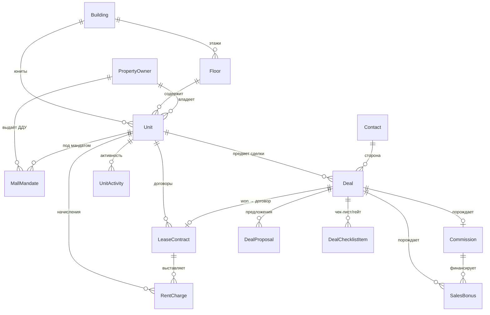
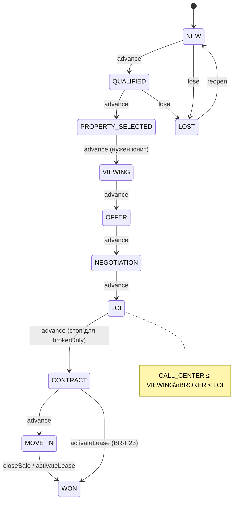
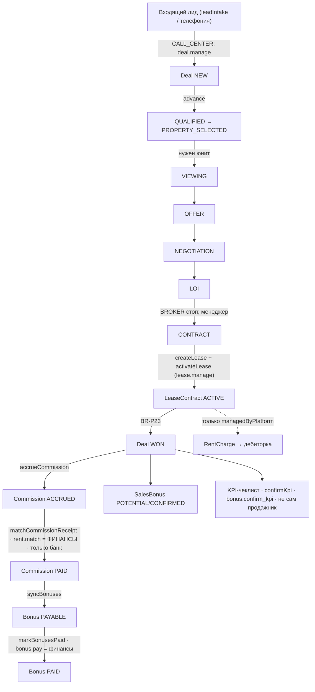
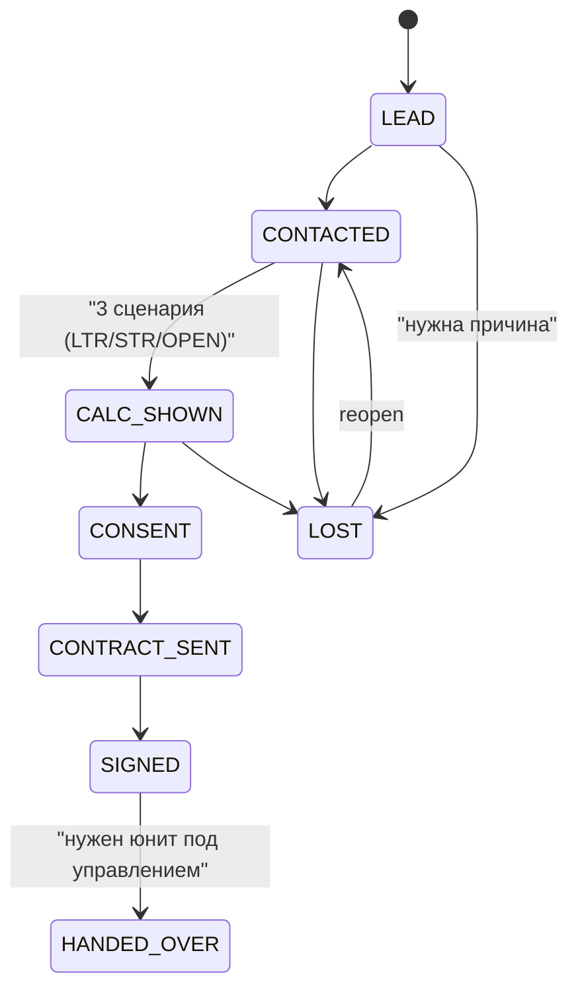

# SYSTEM_MAP — контур Tower (ORDO), карта реального состояния

> **Что это.** Сводная карта контура **Tower** (Property + Commercial/CRM), собранная из
> **реального кода** — Prisma schema, RBAC-матрица, доменные сервисы и тесты, — а не из ТЗ.
> Где ТЗ что-то планирует, но код этого ещё не содержит, стоит пометка **`НЕ ПОСТРОЕНО`** или **`ТОНКО`**.
> Источник истины требований — `docs/22-ordo-tower-tz.md`; источник истины **реализации** — этот файл.
>
> **Легенда статуса:**
> - **`РЕАЛЬНО`** — есть и экран (`page.tsx`), и доменный сервис/схема.
> - **`ТОНКО`** — есть сервис/схема, но нет выделенного экрана (или экран-заглушка).
> - **`НЕ ПОСТРОЕНО`** — только план в ТЗ/TASKS; в коде отсутствует.
>
> Дата сборки: 2026-09-20. Ветка разработки: `claude/own-it-product-w1ij9b`.
> Проверено по: `packages/core/src/rbac`, `packages/core/src/property`, `packages/db/src/services`,
> `packages/db/prisma/schema.prisma`, `packages/db/test`, `apps/web/app/(app)`.

---

## 1. Роли и должности (как реально в RBAC)

### 1.1 Роли (enum) — источник истины

Ровно **15 ролей**. Определены дважды и синхронно:
`packages/core/src/context/index.ts` (`ROLE_CODES`) и `packages/db/prisma/schema.prisma:75` (`enum RoleCode`).

| Роль (код) | Назначение | Контур |
|---|---|---|
| `OWNER` | Владелец бизнеса — финансовый суперпользователь | Finance |
| `FINANCE_OPS_LEAD` | Руководитель финопераций | Finance |
| `JUNIOR_FINANCE` | Младший финансист | Finance |
| `DOCUMENT_CONTROLLER` | Контролёр документов | Finance |
| `ACCOUNTANT` | Бухгалтер | Finance |
| `REQUESTER` | Инициатор заявок | Finance |
| `ADMIN` | Администратор системы | Platform |
| `COMMERCIAL_MANAGER` | Менеджер аренды *(deprecated-алиас → BROKER, ADR-040)* | Tower |
| `BROKER` | Брокер: лиды→сделки→договор→листинг | Tower |
| `OPERATIONS_MANAGER` | Эксплуатация недвижимости | Tower |
| `MARKETING` | Маркетинг/публикации | Tower |
| `CALL_CENTER` | Колл-центр: приём/квалификация лидов, показы (не дальше показа, BR-P62) | Tower |
| `COMMERCIAL_DIRECTOR` | Коммерческий директор: надзор над коммерцией (ADR-038) | Tower |
| `CEO` | Операционный профиль: широкая **видимость**, **ни одного** права изменения/согласования (ADR-038) | Tower |
| `PROPERTY_OWNER` | Собственник помещения (Owner Portal) | Tower |

### 1.2 Маппинг на 4 людей ТЗ vs реальный seed

ТЗ Tower описывает штат из **4 человек**. В коде seed (`packages/db/seed/phaseP.ts`) имена/роли расходятся с ТЗ — это надо знать при разговоре о должностях:

| ТЗ (человек / роль) | Реальный seed (`phaseP.ts`) | Расхождение |
|---|---|---|
| **Умар Назаров** — `CALL_CENTER` | `callcenter@piramit.test` — **Малика Юсупова**, `CALL_CENTER` | имя |
| **Азиз Гулямов** — `BROKER` | `broker@piramit.test` — **Бекзод Тураев**, `BROKER` | имя |
| **Камила Рахимова** — `COMMERCIAL_DIRECTOR` | **не заведён в seed** | **отсутствует** |
| **Мурад Джаббаров** — `CEO` | `owner@piramit.test` — **Мурад Джаббаров**, роль `OWNER` (не `CEO`) | роль |

Дополнительно в seed есть `COMMERCIAL_MANAGER` (Алия Сафарова, `commercial@piramit.test`) — по ТЗ этой должности больше нет (слита в BROKER алиасом), но seed-запись пока живёт.

### 1.3 Статус алиаса CM → BROKER (ADR-040, реализовано)

`packages/core/src/context/index.ts:44`:
```ts
export const ROLE_ALIASES: Partial<Record<RoleCode, readonly RoleCode[]>> = {
  COMMERCIAL_MANAGER: ['BROKER'],
};
```
- **Однонаправленный, обратимый** алиас без миграции. Контекст с `COMMERCIAL_MANAGER` дополнительно распознаётся как `BROKER` (`expandRoles()` при проверках `can()`/`hasRole()`).
- **Не** двунаправленный: `BROKER` **не** получает прав `COMMERCIAL_MANAGER`. Инвариант `BROKER ⊆ CM` сохранён, поэтому для `can()` алиас — no-op.
- Откат: очистить `ROLE_ALIASES`. Живых пользователей-CM нет (только seed).

### 1.4 Матрица прав — ключевые Tower-коды (из `packages/core/src/rbac/matrix.ts`)

Проверка везде через `requirePermission(ctx, code)` → `can()` → `expandRoles(ctx.roles)` (`packages/core/src/rbac/index.ts`). Нет права → `PermissionDeniedError` → **403 `PERMISSION_DENIED:<code>`**. Область видимости («свои сделки», «вся команда») матрица не выражает — это доменная логика.

| Permission | Кто имеет (по matrix.ts) | Смысл |
|---|---|---|
| `deal.view` | OWNER, ADMIN, CM, COMMERCIAL_DIRECTOR, BROKER, MARKETING, CALL_CENTER, CEO, FINANCE_OPS_LEAD | видеть сделки |
| `deal.manage` | OWNER, CM, COMMERCIAL_DIRECTOR, BROKER, CALL_CENTER | создавать/двигать сделки |
| `deal.contact.view` | OWNER, CM, COMMERCIAL_DIRECTOR, BROKER, CALL_CENTER, CEO | видеть PII контакта |
| `lease.view` | OWNER, FINANCE_*, ACCOUNTANT, ADMIN, CM, COMMERCIAL_DIRECTOR, OPERATIONS_MANAGER, CEO, **BROKER** | видеть договоры |
| `lease.manage` | OWNER, CM, COMMERCIAL_DIRECTOR, **BROKER** | заводить/активировать договор |
| `unit.pricing.edit` | OWNER, CM, COMMERCIAL_DIRECTOR | **утверждение цены/ставки** — НЕ брокер |
| `unit.publish` | OWNER, CM, COMMERCIAL_DIRECTOR, MARKETING, BROKER | публиковать в фонд (листинг) |
| `commission.view` | OWNER, FINANCE_*, ACCOUNTANT, ADMIN, CM, COMMERCIAL_DIRECTOR, CEO | видеть комиссии |
| `commission.manage` | OWNER, CM, COMMERCIAL_DIRECTOR | вести комиссии — НЕ брокер |
| `rent.view` | OWNER, FINANCE_*, ACCOUNTANT, ADMIN, CM, COMMERCIAL_DIRECTOR, CEO | видеть дебиторку — **НЕ BROKER** (ADR-043) |
| `rent.match` | OWNER, FINANCE_OPS_LEAD, JUNIOR_FINANCE | **зачесть банк-поступление → PAID** (только финансы) |
| `bonus.view` | OWNER, FINANCE_OPS_LEAD, ADMIN, CM, COMMERCIAL_DIRECTOR, CEO | видеть бонусы |
| `bonus.own` | CM, COMMERCIAL_DIRECTOR, BROKER | видеть свой бонус |
| `bonus.confirm_kpi` | OWNER, CM, COMMERCIAL_DIRECTOR | подтвердить KPI-чеклист |
| `bonus.pay` | OWNER, FINANCE_OPS_LEAD | **отметить выплату бонуса** (только финансы/владелец) |
| `mall.manage` | OWNER, CM, COMMERCIAL_DIRECTOR | ДДУ/мандаты ТРЦ — НЕ брокер |
| `owner.activity` | OWNER, CM, COMMERCIAL_DIRECTOR, CALL_CENTER, OPERATIONS_MANAGER | вести собственников — **НЕ брокер** (docs/21 §4) |
| `policy.manage` | OWNER, ADMIN | настройки/пороги (`tower_setting`) |

### 1.5 Деньги и SoD — кто что НЕ может (критично)

Разделение обязанностей обеспечено **разделением permission-кодов** + одним явным доменным гейтом:

- **PAID по комиссии ставит только финансы.** `matchCommissionReceipt` требует `rent.match` (OWNER/FINANCE_OPS_LEAD/JUNIOR_FINANCE). У `BROKER`/`COMMERCIAL_MANAGER`/`COMMERCIAL_DIRECTOR` кода `rent.match` **нет** → брокер физически не может закрыть свою комиссию. PAID выставляется **только из банковской транзакции**, не кнопкой UI (BR-P42, non-negotiable #6).
- **Утверждение цены/ставки** — `unit.pricing.edit` (OWNER/CM/COMMERCIAL_DIRECTOR). Брокер не утверждает цену.
- **Выплата бонуса** (`bonus.pay`, финансы/владелец) **отделена** от **подтверждения KPI** (`bonus.confirm_kpi`, коммерция).
- **KPI нельзя подтвердить самому себе** — единственный явный four-eyes-гейт в деньгах: `assertKpiConfirmable` (`packages/core/src/property/commission.ts:122`):
  ```ts
  if (i.confirmerId === i.salespersonId)
    throw new ValidationError('KPI_SELF_CONFIRM', 'чек-лист подтверждает коммерческий менеджер, не продажник');
  ```
  Вызывается из `confirmKpi` с `confirmerId: ctx.userId, salespersonId: deal.managerId`.
- **CEO** по матрице — только `*.view` + дашборды + аудит, **ни одного** права на изменение/согласование (не может нарушить контроли).

> ⚠️ **Расхождение ТЗ ↔ код (деньги §6.4).** ТЗ требует: PAID по комиссии ставит **COMMERCIAL_DIRECTOR** (наличные от брокера). В коде PAID идёт через `rent.match` = **финансы** (bank-match). Директорского «подтверждения получения кэша» как отдельного действия/статуса **пока нет** — это Phase 3 (§6.4). Сейчас модель — только банковский зачёт.

### 1.6 Навигация по ролям (UI, `apps/web/app/(app)/layout.tsx`)

Это не права, а фокус-меню. Существенно: **выделенных экранов «инбокс КЦ», «пульт директора», «пульт исключений CEO» нет** — роли ходят по общим экранам:
- `CALL_CENTER` → `me`, `deals`, `contacts`, `tasks` (очередь входящих видит через `/deals` + `/me`).
- `COMMERCIAL_DIRECTOR` → `me`, `deals`, `contacts`, `crmAnalytics`, `commissions` (отдельного пульта нет).
- `CEO` → `/ceo` = «Утро CEO» (break-even), **не** пульт исключений.

---

## 2. Доменная модель и взаимосвязи (как реализовано)

### 2.1 Модели схемы (Tower) и связи

Все модели — в `packages/db/prisma/schema.prisma`, мульти-тенантные (`tenant_id` везде), soft-only (hard-delete избегается), зеркалирование статуса юнита из договора.

Ключевые сущности:
- **Building** → **Floor** → **Unit** (иерархия фонда; `Unit.geometry` — полигон в `Floor.planViewBox`).
- **PropertyOwner** — собственник (воронка `pipelineStage`, согласия, договор управления). Owner Portal через `userId` (роль `PROPERTY_OWNER`).
- **Unit** — мульти-осевой статус: `readiness · occupancy · rentalMode · leaseStatus · commercialStatus · operationalStatus`; зеркалит договор (`monthlyRentMinor`, `leaseEndsAt`, `occupantName`); `managedByPlatform` — под управлением ли (ключ для дебиторки).
- **LeaseContract** — источник истины occupancy/rentalMode/leaseStatus юнита; порождает `RentCharge`.
- **Contact** (CRM, один на много сделок) → **Deal** → **DealProposal** (публичная подборка), **UnitActivity**, **Commission**, **SalesBonus**, **DealChecklistItem**.
- **RentCharge** — начисление аренды (только под управлением); PAID — по банку.
- **Commission** (одна на сделку, `@unique dealId`) → **SalesBonus** (DEAL/KPI).
- **MallMandate** — ДДУ на управление помещением ТРЦ (единственная «мандатная» сущность в коде).
- **TowerSetting** — key/value (JSON) пороги/ставки per-tenant (M2), отдельно от `ApprovalPolicy`.
- **AuditLog** — неизменяемый hash-chain per tenant.
- **DomainEvent** — outbox без PII (`deal.stage.changed`, `lease.activated`, …).



### 2.2 Ключевые enum и стейт-машины

**Deal (`DealStage`) — `packages/core/src/property/deal.ts`.**
Стадии: `NEW → QUALIFIED → PROPERTY_SELECTED → VIEWING → OFFER → NEGOTIATION → LOI → CONTRACT → MOVE_IN → WON | LOST`.
Триггеры: `advance` (на один шаг), `back` (на один шаг, из любой активной кроме NEW), `lose`, `reopen` (LOST→NEW), `win`. Владелец переходов — `deal.manage`.
Гейты (guard в `deal.ts`):
- с `VIEWING` и далее нужен выбранный юнит → `DEAL_UNIT_REQUIRED`;
- `CALL_CENTER` не выше `VIEWING` → `CALL_CENTER_STAGE_LIMIT` (BR-P62);
- `brokerOnly` не выше `LOI` → `BROKER_STAGE_LIMIT` (контрактные стадии — за менеджером);
- `win` не через `advance`: WON выставляется только `activateLease` (аренда, BR-P23) или `closeSale` (продажа); `win` для не-продажи требует `hasLease`.



> ⚠️ **Гейт DUE_DILIGENCE не реализован как переход.** Значение `KpiChecklistItem.DUE_DILIGENCE` заведено (M1) и исключено из бонус-чеклиста, но **в машине сделки перед `CONTRACT` ничего не проверяет** — это только комментарий в `commissions.ts`. Enforcement — Phase 2c/3.

**LeaseContract (`LeaseContractStatus`) — `packages/core/src/property/lease.ts`.**
`DRAFT → ACTIVE → EXPIRING → TERMINATED`. `activate`: один активный на юнит (`LEASE_ALREADY_ACTIVE`); `mark_expiring` — системный job без права; `terminate` — с причиной. Владелец — `lease.manage` (в т.ч. BROKER, ADR-041). Активация DRAFT-договора переводит связанную сделку в WON.

**Commission (`CommissionStatus`).** `ACCRUED → PARTIAL → PAID | CANCELLED`.
**SalesBonus (`BonusStatus`).** `POTENTIAL → CONFIRMED → PAYABLE → PAID | WITHHELD` (чистая функция `deriveBonusStatus`).
**RentCharge (`RentChargeStatus`).** `DUE / PARTIAL / OVERDUE / PAID / WAIVED` — статус **производный** от полученной суммы и срока (`rentChargeStatus`), PAID только при полном покрытии из банк-зачёта.
**PropertyOwner (`OwnerStage`).** `LEAD → CONTACTED → CALC_SHOWN → CONSENT → CONTRACT_SENT → SIGNED → HANDED_OVER | LOST` (вперёд по одной, назад на одну, `HANDED_OVER` требует юнит под управлением, `LOST` требует причину).
**MallMandate (`MandateStatus`).** `DRAFT → SIGNED → ACTIVE → TERMINATED`; ACTIVE ставит `unit.managedByPlatform = true`.

### 2.3 Денежная логика — как реализовано

- **Начисление (ACCRUED):** `accrueCommission` (`packages/db/src/services/commissions.ts`) — **только на WON**, внутри транзакции (из `activateLease` или `closeSale`). Ставка — `computeCommission(product, base, rateBpOverride)`: аренда 50% месяца, продажа 3% с коридором 1,5–3%; STR/ТРЦ (`rateBp = null`) → `COMMISSION_RATE_OPEN`, комиссия ждёт. `netMinor` вычитает долю внешнего брокера. Тут же создаются строки `SalesBonus` и (для аренды) пункты KPI-чеклиста.
- **PAID:** `matchCommissionReceipt` — **только из входящей банковской транзакции**, требует `rent.match` (финансы), пишет `ReconciliationMatch(COMMISSION)`, флипает bankTx в `MANUAL_MATCHED`, клампит без переплаты (`validateReceipt`). Ни кнопки «Оплачено» в UI, ни закрытия брокером — нет.
- **Отмена:** `cancelCommissionForDeal` (проигрыш/расторжение до поступления) → `CANCELLED`; при `receivedMinor > 0` — отказ (ручное решение финансов).
- **Бонусы:** `syncBonuses` пере-выводит статусы при каждой смене статуса комиссии; PAYABLE выставляется автоматически когда комиссия PAID; `markBonusesPaid` (`bonus.pay`, финансы) переводит PAYABLE→PAID с номером ведомости; просрочка KPI → `WITHHELD`.
- **Дебиторка:** `getReceivablesSummary` (`services/rent.ts`, в control-room) считается **только из `RentCharge`** в статусах `DUE/PARTIAL/OVERDUE`. По комиссии есть per-row `outstandingMinor` в `listCommissions`, но **сводной «дебиторки = комиссии + пул» в коде нет**.
- **Аренда/дебиторка только под управлением:** `generateRentCharges` фильтрует `unit.managedByPlatform = true` (BR-P40). При брокеридже LTR/офисов аренда идёт собственнику напрямую — **ORDO её не собирает и дебиторку не ведёт**. `BROKER` без `rent.view` (ADR-043).



### 2.4 Воронка собственника (owner pipeline)



### 2.5 Паркинг-пул — `НЕ ПОСТРОЕНО`

Сущности/сервиса пула нет. Есть только конфиг-гипотеза за флагом: `FEATURE_POOL_COMMISSIONS` (default false), `TOWER_POOL_COMMISSION_BP = 1500`, `poolManagementCommissionMinor()` (возвращает 0 без флага). Таблицы `ParkingPool`/`PoolSpace`/`PoolRental`, дебиторки по пулу — **нет** (план TWR-03.5).

### 2.6 Инварианты и guard'ы, уже стоящие в коде

- **Аудит обязателен:** `withAudit(actor, fn)` (`packages/db/src/audit.ts`) — мутация + запись аудита в одной транзакции; если запись аудита не вернулась — бросает ошибку (BR-070). Хэш-цепочка `computeDiffHash(prevHash, before, after)` под advisory-lock per tenant; PII в аудит не пишется.
- **Tenant-изоляция:** `findScopedOr404` / `whereTenant` (`repository.ts`) — чужой tenant неотличим от несуществующего → **404** (BR-073). Плюс row-level для брокера (`loadOwnDeal`/`brokerOnly`, BR-P21) → чужая сделка = 404.
- **Одна активная аренда на юнит** (`LEASE_ALREADY_ACTIVE`); **один активный мандат на юнит** (`MANDATE_ALREADY_ACTIVE`); **одна комиссия на сделку** (`@unique dealId`); **защита от переплаты** (`validateReceipt` → `OVERPAYMENT`).
- **Дедуп следующего действия:** jobs проверяют открытые задачи перед созданием (`DEAL_FOLLOWUP`, `RENT_OVERDUE`, expiry) — это guard в коде job'а, не DB-constraint.
- **`НЕ ПОСТРОЕНО`: «противоречие → Exception».** Обобщённого механизма «конфликт статусов юнита → Exception с владельцем CEO» для Tower **нет**. `Exception`/`exceptionType` в схеме относятся только к Purchase-to-Pay (платежи), не к сделкам/аренде.

---

## 3. Что уже сделано vs запланировано

### 3.1 По фазам и миграциям

| Фаза | Статус | Коммит | Содержание | Тесты |
|---|---|---|---|---|
| **TWR-01 / Phase 1** (ADR-040) | ✅ DONE | `8e184b5` | CM→BROKER deprecated-алиас (обратимо, без миграции); фиче-флаги STR/MALL/POOL (off); дефолты порогов/ставок в `core/config/towerSettings.ts`; `ApprovalPolicy` не трогали | зелёные |
| **TWR-02a** (ADR-041/042) | ✅ DONE | `e2823b9` | Селективный мёрж CM→BROKER: BROKER получил `lease.view/manage`, `unit.publish` (и врем. `rent.view`); SoD не протёк (нет `mall.manage`/`commission.manage`/`unit.pricing.edit`/`owner.activity`/`bonus.confirm_kpi`/`rent.match`); `setLeaseTenantCategory` пере-гейчен на `mall.manage`; TWR-BUG my-day (ADR-042) | 539 зелёных |
| **TWR-02b** (ADR-043/044) | ✅ DONE | `04f32ff` | §1-корректива: брокеридж без дебиторки → у BROKER **снят** `rent.view`; **применены M1 + M2**; сервис порогов (live-edit, `policy.manage`) | 543 зелёных |
| **M1** `due_diligence_checklist` | ✅ применена в dev | `04f32ff` | `ALTER TYPE "KpiChecklistItem" ADD VALUE 'DUE_DILIGENCE'`. Откат: значение аддитивное, пересоздание типа | — |
| **M2** `tower_setting` | ✅ применена в dev | `04f32ff` | `CREATE TABLE tower_setting`. Откат: `DROP TABLE tower_setting` | покрыт `tower-settings` тестом |
| **TWR-02c** (ADR-044) | 🔲 OPEN | — | ставка+срок+арендатор на видах фонда из зеркала Unit (не rent-ledger) — реализовано только в кликабельном превью, в реальных экранах ещё нет | — |
| **M3** (Intent + light Mandate + `RESERVED`) | 🔲 **ПРЕДЛОЖЕНА, не создана** | — | В репозитории миграции M3 нет. Предложение на ревью (см. §3.4) | — |
| **TWR-03 / Phase 3** | 🔲 OPEN | — | деньги §6.4 (директор ставит PAID по кэшу; дебиторка комиссий); Contract+документы §6.3; Handoff+Exception; **пульт директора** | — |
| **TWR-03.5** | 🔲 OPEN | — | паркинг-пул §5.3 (инвентарь, тарифы, сбор, дебиторка, 15%) | — |
| **TWR-04 / Phase 4** | 🔲 OPEN | — | движок алертов §8 из `tower_setting`; **пульт исключений CEO** | — |
| **TWR-05 / Phase 5** | 🔲 OPEN | — | листинг §5.2; смена собственника; кладовые/депо | — |

ADR в `DECISIONS.md`: **040** (SPEC v1, алиас/флаги/настройки), **041** (селективный мёрж, SoD не течёт), **042** (детерминизм «Мой день»), **043** (брокеридж без дебиторки, BROKER без rent.view), **044** (виды фонда: ставка/срок/арендатор из зеркала Unit). Раньше: 038 (директор+CEO как профили), 039 (ролевая навигация).

### 3.2 Статус по модулям/экранам

**`РЕАЛЬНО` (есть экран + сервис):**

| Модуль | Экран | Сервис |
|---|---|---|
| Живое здание 2.5D | `/property` | `property.ts` |
| План этажа | `/property/floors/[id]` | `property.ts` |
| Unit 360 | `/property/units/[id]` | `property.ts`, `rent.ts` |
| Control Room («сегодня») | `/property/today` | `controlRoom.ts` |
| Воронка собственников | `/property/owners`, `/owners/[id]` | `ownerPipeline.ts` |
| Workbot-инбокс (черновики действий) | `/property/actions` | `actionDrafts.ts` |
| Доска сделок / карточка / новая | `/deals`, `/deals/[id]`, `/deals/new` | `deals.ts` |
| Аналитика сделок / CRM | `/deals/analytics`, `/crm/analytics` | `dealAnalytics.ts`, `crmAnalytics.ts` |
| Клиенты (CRM) | `/contacts`, `/contacts/[id]` | `contacts.ts` |
| Договоры аренды | `/leases` | `leases.ts` |
| Аренда и дебиторка | `/rent` | `rent.ts` |
| Комиссии ORDO | `/commissions` | `commissions.ts` |
| Бонусы | `/bonuses` | `commissions.ts` |
| ORDO Mall (мандаты/tenant mix) | `/mall` | `mall.ts` |
| Деньги дома | `/house` | `house.ts` |
| «Мой день» | `/me` | `myDay.ts` |
| Owner Portal | `/owner` | `ownerPortal.ts` |
| Портфель | `/portfolio` | `portfolio.ts` |

**`ТОНКО` (сервис без экрана):**
- **Инбокс колл-центра** — бэкенд есть (`leadIntake.ts`, `telephony.ts`, роль CALL_CENTER), но выделенного экрана «Очередь входящих» нет (TWR-02, `[~]`); КЦ работает через `/deals` + `/me`.
- **Настройки порогов Tower** — `towerSettings.ts` (`getTowerThresholds`/`setTowerThreshold`, `policy.manage`, аудит, таблица `tower_setting`) — **UI нет** (`grep TowerThreshold apps/web` = 0).

**`НЕ ПОСТРОЕНО`:**
- **Пульт директора** (COMMERCIAL_DIRECTOR, §5.3) — нет маршрута/экрана (TWR-03).
- **Пульт исключений CEO** (§5.4) — `/ceo` = «Утро CEO» break-even, не пульт исключений (TWR-04).
- **Паркинг-пул** — ни экрана, ни сервиса, ни таблиц (TWR-03.5).
- **Виды фонда со ставкой/сроком/арендатором** в реальных Next-экранах (TWR-02c) — есть только в превью.
- **Intent (коммерческий)** — как сущность цели покупателя/арендатора нет; «Intent» в коде = NL-намерения Workbot (`IntentKind` в `packages/adapters/src/workbot`). LOI — лишь стадия сделки.
- **Mandate (брокеридж, §6.5)** — лёгкой мандатной сущности нет; есть только `MallMandate` (ДДУ ТРЦ).
- **Handoff** — сущности/воркфлоу нет; «передача» = стадия `HANDED_OVER` собственника + пункт `HANDOVER_SERVICES` в KPI-чеклисте.
- **Exception (Tower)** — обобщённого «противоречие→Exception» для сделок/аренды нет (Exception есть только в P2P-платежах).

### 3.3 Покрытие тестами (акценты)

- **~543 теста, зелёные; `.skip`/`it.todo` в коде нет.** BR-P01..P62.
- **SoD/four-eyes:** `commissions.test.ts` (KPI self-confirm `KPI_SELF_CONFIRM`, BROKER→`PermissionDenied`, PAID только через банк-зачёт, кросс-тенант 404); `work-orders`/`service` (verify не исполнителем, нужен фото + другой человек).
- **Permission/тенант:** `property.test.ts` (403 без права, 404 чужой тенант), `contacts`, `rent-charges`, `house`, `cross-tenant-fuzz` (BR-073), `permissions.test.ts` (синк матрицы).
- **Пусто:** `packages/db/test/deals.test.ts` — файл без тестов (покрытие сделок — в `property-wave2`, `call-center`, `my-day`).

### 3.4 Предложение M3 (гейт, на ревью — не применено)

Для реального backend 2c (см. Phase 2c/3): новые enum `IntentStatus`, `MandateLevel`; таблицы `intent`, `mandate`; `ALTER TYPE "DealStage" ADD VALUE 'RESERVED'` (стадия §5.1 между NEGOTIATION и LOI сейчас отсутствует). Откат: `DROP TABLE mandate; DROP TABLE intent; DROP TYPE ...` (значение `RESERVED` остаётся). Ждёт «go» пользователя (изменение source-of-truth).

### 3.5 Открытые вопросы, баги, техдолг

- **Расхождение деньги §6.4:** код ставит PAID через `rent.match` (финансы, банк-зачёт); ТЗ требует подтверждение директором по кэшу. Директорского действия/статуса нет — Phase 3.
- **Расхождение «дебиторка»:** комментарий матрицы говорит «комиссии + пул», реализованный `getReceivablesSummary` считает **только RentCharge**; пул не существует. Свести при TWR-03/03.5.
- **DUE_DILIGENCE** заведён как значение, но **не enforced** как гейт перед CONTRACT — только комментарий. Реализовать в 2c/3.
- **Док-несоответствие TWR-BUG:** ADR-042/CHANGELOG говорят, что 2 date-sensitive теста «Мой день» починены; в `TASKS.md` (строка ~164) висит устаревший открытый пункт про те же тесты. Свести (снять открытый пункт).
- **Техдолг:** сервис порогов без UI; `deals.test.ts` пустой; для BROKER `/rent` и финблок control-room возвращают null (осознанно, ADR-043) — учесть в UI, чтобы не выглядело «сломано».
- **Открыто из ТЗ §12:** число мест пула (~300), кладовые/депо, механика сеттлмента, тексты договоров/pricing authority, суммы бонусов, значения порогов §8.

---

---

## 4. Operating Model overlay (профили ролей + Tower chain)

> Добавлено фактически: где Operating Model уточнила понимание и появились **подтверждённые conflicts/gaps**. Статусы реализации в §1–§3 **не меняются** — OM-решения ещё не в коде.

**Документы Operating Model (не код, требования):**
- `docs/23-role-call-center.md` — `CALL_CENTER` (Умар)
- `docs/24-role-broker.md` — `BROKER` (Азиз)
- `docs/25-role-commercial-director.md` — `COMMERCIAL_DIRECTOR` (Камила), OM v1
- `docs/26-role-ceo.md` — `CEO` (Мурад)
- `docs/27-tower-operating-chain.md` — сводная цепочка `Умар→Азиз→Камила→CEO`

**Подтверждённые CONFLICT (код ≠ Operating Model) — к пересмотру, деструктивно не тронуто:**
- `BROKER_MAX_STAGE = LOI` vs брокер полного цикла (OM: до `MOVE_IN`; `WON` из события — уже совпадает).
- `CALL_CENTER_MAX_STAGE = VIEWING` + `scheduleViewing` vs «КЦ не назначает показы» (техническое решение зависит от Intake vs Deal — OPEN).
- `unit.pricing.edit` у CM/директора vs «финальную цену ставит собственник» + отсутствие истории цены.
- `commission.manage` у директора — право шире workflow (сузить до view; авто-экономику не редактировать руками).
- `lease.manage` у директора — reconcile: managerial fallback или убрать.

**Новые confirmed GAP (OM требует — в коде нет):** CASH-settlement путь + Cash Desk actor (OPEN) · Handover/move-in record · Protected documents (restricted class) · Marketing handoff / Listing-объект · Reservation-объект · Owner discovery / commercial intent (пересекается с Intent M3) · external-broker split-approval · пульт директора (drill-down/QA/workload/планы) · CEO Home / portfolio rollup · Exception/Escalation для Tower · тип актива `DEPO` · Камила в seed · CEO-дефолт-UX поверх OWNER-прав.

**Не менять без отдельного решения:** M3-дизайн (пересматривается позже под chain), state machines, матрица прав, зеркалирование `Unit↔LeaseContract`, bank-match.

---

*Карта отражает состояние кода на ветке `claude/own-it-product-w1ij9b` на дату сборки. При изменении схемы/матрицы/сервисов — обновлять этот файл в том же коммите.*
